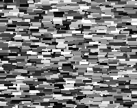
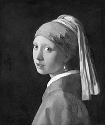

# Genetic Image
## Overview
This project uses a genetic algorithm to recreate images with simple shapes like circles, squares, rectangles. The algorithm evolves a population of images to minimize the difference between a target image and the generated images over successive generations.
## Results
P-population G-generations S-shapes
### Mona Lisa

<table width="75%">
  <tr>
    <th>Orignal</th>
    <th>Circles</th>
    <th>Squares Empty Rotated 45</th>
  </tr>
  <tr>
    <td width="25%"></td>
    <td width="25%">P-400, G-5000, S-3000</td>
    <td width="25%">P-400, G-5000, S-3000</td>
  </tr>
  <tr>
    <td width="25%"></td>
    <td width="25%"></td>
    <td width="25%"></td>
  </tr>
</table>

### Starry Night

<table width="75%">
  <tr>
    <th>Orignal</th>
    <th>Rectangles</th>
    <th>Circles Empty</th>
  </tr>
    <tr>
    <td></td>
    <td>P-200, G-6500, S-3000</td>
    <td>P-100, G-20000, S-5000</td>
  </tr>
  <tr>
    <td></td>
    <td></td>
    <td></td>
  </tr>
</table>

### Girl with a Pearl Earring

<table width="50%">
  <tr>
    <th>Orignal</th>
    <th>Squares Rotated 45</th>
  </tr>
    <tr>
    <td></td>
    <td>P-200, G-10000, S-4000</td>
  </tr>
  <tr>
    <td></td>
    <td></td>
  </tr>
</table>

## Algorithm Details
### Fitness
The fitness function determines how closely the image composed of shapes matches the original image. This project utilizes the Structural Similarity Index Measure (SSIM) from the scikit-image library.
### Mutation
The mutation process replaces one of the genes with a newly generated one, with each gene having a probability of mutation equal to mutation rate.
### Parent Selection
Parents are selected using a tournaments selection, which randomly selects a subset of individuals form population and return the fittest one of them.
### Crossoever
Crossover is perfomred using uniform method, where each gene has a 50% chance of being inherited from either parent. Two parents produce two offsprings with opposing genes.
## Why is it greyscale?
There are only 256 colors when using greyscale comapred to 16,777,216 when using RGB making it easier to for algorithm to find fitting color for shape.
## What affects execution speed
- image size
- population size
- number of shapes being used
- usign outline width higher than 1
- size of shapes
## Usage
Python version 3.9 or higher.\
\
Installing requirements:
```
pip install -r requirments.txt
```
Algortihm's controls are inside ```genetic-image/main.py``` file:
```python
# Images
TARGET_IMAGE_PATH = "../examples/targets/starry_night.png"
STARTING_IMAGE_PATH = "" # Optional
IMAGE_SCALE = 1 # Lower scale improves efficency
# Shapes
SHAPE_TYPE = shapes.RECTANGLE
SHAPE_SIZE = 4
SHAPE_RECTANGLE_RATIO = 2.5
SHAPE_ROTATION = 0 # Radians - math.pi = 180degree
SHAPE_OUTLINE = 0
# Algorithm
NUMBER_OF_SHAPES = 3000
NUMBER_OF_INDIVIDUALS = 200
MUTATION_RATE = 0.0004
CROSSOVER_RATE = 0.9
TOURNAMENT_SIZE = 8
# Saving
SAVE_DIR_PATH = "imgs"
SAVE_IMG_EVERY = 50
```
Running:
```
py main.py
```
